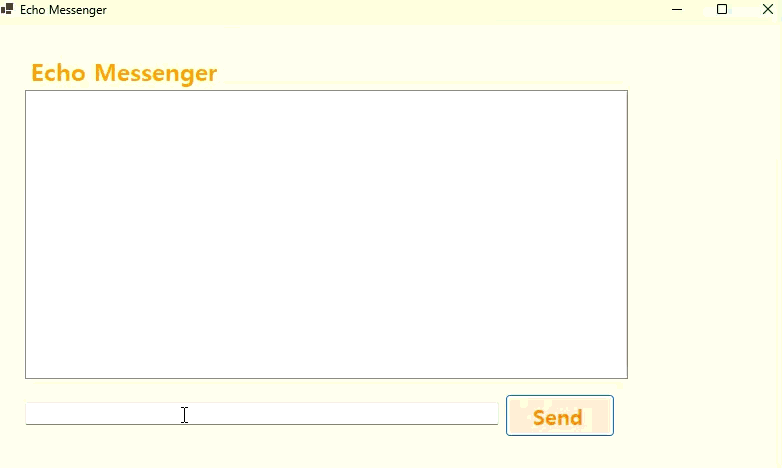

# 에코 메신저

## 개요

- C# 프로그래밍 학습

- 1줄 소개: 텍스트 박스에 입력한 메시지를 리스트 박스에 추가하는 간단한 메신저 프로그램
- 사용한 플랫폼:
	- C#, .NET Windows Forms, Visual Studio, GitHub 사용한 컨트롤:
- 사용한 컨트롤:
	- Label, TextBox, ListBox, Button
- 사용한 기술과 구현한 기능:
    -focus 메서드를 이용하여 텍스트 박스에 포커스 이동 기능 구현
    -string 클래스의 Trim 메서드를 이용하여 입력값의 앞뒤 공백 제거 기능 구현

## 실행 화면 (과제1)
- 과제1 코드의 실행 스크린샷

- 과제 내용
	- Label, TextBox, Button, ListBox를 적절한 이름으로 명명하고 배치하기
	- Send 버튼을 클릭했을 때 TextBox에 입력된 텍스트가 ListBox에 추가되는 기능을 구현하기
	- ListBox에 항목이 추가된 후 TextBox의 내용을 비우는 기능 구현하기

- 구현 내용과 기능 설명
	- TextBox(입력창)에 입력한 텍스트가 ListBox(대화창)에 추가되어 표시된다.
	- Send 버튼을 클릭하면 TextBox의 텍스트가 ListBox에 추가된다.

- 사용한 기술과 구현한 기능
	- Label, TextBox, Button, ListBox 같은 컨트롤을 사용하여 UI 구성
	- Button의 Click 이벤트 사용하여 메시지 전송 기능 구현

## 실행 화면 (과제2)
- 과제2 코드의 실행 스크린샷

- 과제 내용
	- 입력창의 기존 메시지 초기화 기능 구현하기
	- 입력창에 포커스 갖다 놓는 기능 구현하기
	- 엔터키로 전송하는 기능 구현하기
	- 빈 문자열 혹은 공백만 입력했을 때 메시지가 전송되지 않도록 구현하기

- 구현 내용과 기능 설명
	- 메시지 입력 후 textBox는 초기화되고 포커스가 textBox로 이동한다.
	- 엔터키를 누르면 메시지가 전송된다.
	- 빈 문자열 혹은 공백만 입력했을 때 메시지가 전송되지 않는다.

- 사용한 기술과 구현한 기능
	- Clear과 focus 메서드를 이용하여 텍스트 박스에 포커스 이동 기능 구현
	- KyeDown 이벤트를 이용하여 엔터키로 메시지 전송 기능 구현

## 실행 화면 (과제3)
- 과제3 코드의 실행 스크린샷

- 과제 내용
	- 메시지 앞에 현재 시간을 표시하는 기능 구현하기
	- 몇 개의 메시지가 있는지 표시하는 기능 구현하기
	- 메시지 앞 뒤의 빈 공백 제거 기능 구현하기

- 구현 내용과 기능 설명
	- 메시지 앞 뒤 불필요한 공백이 제거된다.
	- (그 외 구현 실패)

- 사용한 기술과 구현한 기능
	- Trim 메서드를 이용하여 공백 제거 기능 구현

## 실행 화면 (과제4)
- 과제4 코드의 실행 스크린샷

- 과제 내용
	- 선택한 특정 메시지를 삭제하는 기능 구현하기
	- 버튼 클릭시 전체 대화 삭제 기능 구현하기
	- 글자 수 50자 제한 기능 구현하기

- 구현 내용과 기능 설명
	- (구현 실패)

- 사용한 기술과 구현한 기능
	-