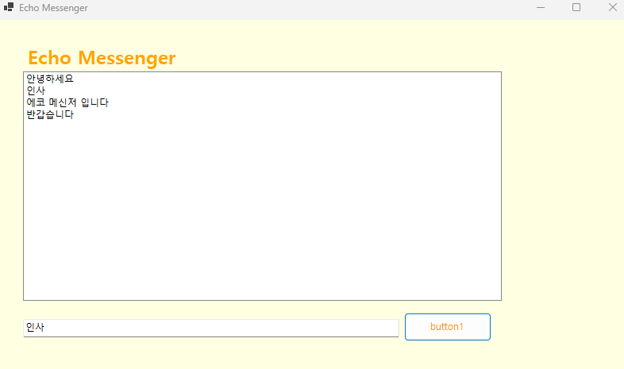
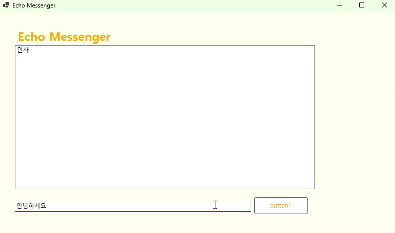

# 에코 메신저

## 개요
-C# 프로그래밍 학습
-핵심기능 : txstBox, listBox 기능

## 실행화면

textBox에 입력한 텍스트가 listBox에 추가됩니다.

(gif)
메시지 입력 후 textBox는 초기화되고 포커스가 textBox로 이동하는 기능을 구현하였습니다
더하여 엔터키로 메시지를 전송하는 기능도 구현하였습니다.

느낀점

